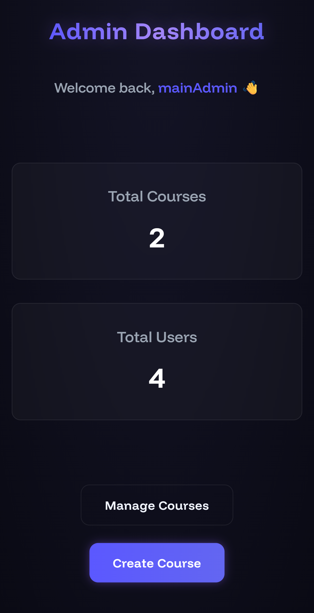
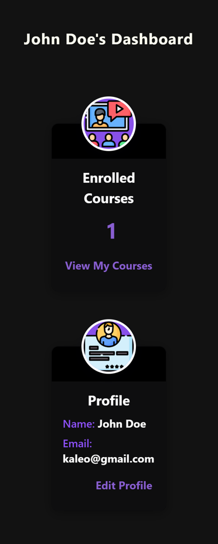
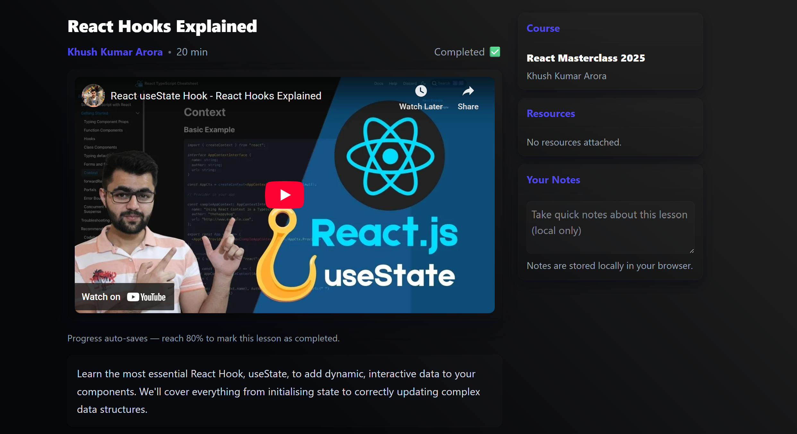

# 🎓 Learning Management System (LMS)

A modern, full-featured Learning Management System inspired by Udemy and Coursera, built with React, Firestore, and Supabase.


## ✨ Features

### For Students
- 📚 Browse and enroll in courses
- 🎥 Watch video lessons (YouTube & native video support)
- ✅ Automatic progress tracking (80% completion threshold)
- 📊 Track completed lessons
- 📝 Take notes during lessons

### For Admins 
- 👥 User management
- 🔐 Role-based access control
- 📖 Create and manage courses
- 🎬 Add/edit/delete lessons
- 🎯 Course quality control
- 🗑️ Cleanup duplicate lessons
- 👁️ Preview mode without enrollment tracking

## 🚀 Tech Stack

- **Frontend**: React 18, Vite
- **Styling**: Tailwind CSS, Custom CSS Modules
- **State Management**: Redux Toolkit
- **Database**: Firebase Firestore
- **Storage**: Supabase (thumbnails)
- **Authentication**: Firebase Auth
- **Routing**: React Router v6
- **Video Player**: YouTube IFrame API

## 📦 Installation

### Prerequisites
- Node.js (v16 or higher)
- npm or yarn
- Firebase account
- Supabase account

### Setup Instructions

1. **Clone the repository**
   ```bash
   git clone <your-repo-url>
   cd lms-app
   ```

2. **Install dependencies**
   ```bash
   npm install
   ```

3. **Configure Firebase**
   - Create a Firebase project at [firebase.google.com](https://firebase.google.com)
   - Enable Firestore Database
   - Enable Authentication (Email/Password)
   - Copy your Firebase config

4. **Configure Supabase**
   - Create a project at [supabase.com](https://supabase.com)
   - Create a storage bucket named `course-thumbnails`
   - Set bucket to public
   - Copy your Supabase URL and anon key

5. **Create `.env` file**
   ```env
   VITE_FIREBASE_API_KEY=your_firebase_api_key
   VITE_FIREBASE_AUTH_DOMAIN=your_project.firebaseapp.com
   VITE_FIREBASE_PROJECT_ID=your_project_id
   VITE_FIREBASE_STORAGE_BUCKET=your_project.appspot.com
   VITE_FIREBASE_MESSAGING_SENDER_ID=your_sender_id
   VITE_FIREBASE_APP_ID=your_app_id
   
   VITE_SUPABASE_URL=your_supabase_url
   VITE_SUPABASE_ANON_KEY=your_supabase_anon_key
   ```

6. **Run development server**
   ```bash
   npm run dev
   ```

7. **Build for production**
   ```bash
   npm run build
   ```

## 🗂️ Project Structure

```
laern-code-lms/
├── extra/
├── src/
│   ├── auth/                 #  User Authetication
│   ├── components/           #  Reusable UI components
│   ├── database/             #  Firebase & Supabase configuration
│   ├── icons/                #  Static assets, Images, fonts, etc.
│   ├── middleware/           #  Custom middleware (Toast, etc.)
│   ├── pages/                #  Page components
│   ├── ReduxToolKit/         #  Redux slices and store
│   └── routes/               #  App Routes                 
├── .env                      #  Environment variables (not committed)
├── package.json
├── vite.config.js
└── README.md
```

## 🎯 Key Features Implementation

### Progress Tracking
- Automatically marks lessons as complete when 80% watched
- Works with both YouTube and native video players
- Persists progress in Firestore

### Role-Based Access
- **Students**: Can enroll and complete courses
- **Admins**: Full system access including course creation & management

### Video Player
- YouTube iframe integration with API
- Native HTML5 video player fallback
- Progress monitoring every 2 seconds
- Handles video state changes

## 🔐 Security

- Firebase Authentication for secure user management
- Firestore security rules for data access control
- Role-based access control (RBAC)
- Protected routes for authenticated users only
- Supabase RLS policies for storage security

## 🌐 Deployment

### Vercel (Recommended)
1. Push code to GitHub
2. Import project in Vercel
3. Add environment variables
4. Deploy

### Netlify
1. Build project: `npm run build`
2. Deploy `dist` folder to Netlify
3. Configure environment variables
4. Set up redirects for SPA

## 📸 Screenshots

### Admin Dashboard


### Student Dashboard


### Course Player


## 🤝 Contributing

Contributions are welcome! Please follow these steps:
1. Fork the repository
2. Create a feature branch (`git checkout -b feature/AmazingFeature`)
3. Commit changes (`git commit -m 'Add AmazingFeature'`)
4. Push to branch (`git push origin feature/AmazingFeature`)
5. Open a Pull Request

## 📄 License

This project is licensed under the MIT License - see the LICENSE file for details.

## 👤 Author

**Your Name**
- Portfolio: [your-portfolio.com](https://your-portfolio.com)
- GitHub: [@yourusername](https://github.com/yourusername)
- LinkedIn: [Your Name](https://linkedin.com/in/yourprofile)

## 🙏 Acknowledgments

- Inspired by Udemy and Coursera
- Firebase for backend services
- Supabase for storage solutions
- React and Vite communities

## 📞 Support

For support, email khushansh.arora2@gmail.com or open an issue in the repository.

---

Made with ❤️ using React